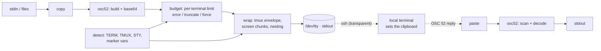

# clipwarp

[English](README.md) | [中文](README.zh.md) | [日本語](README.ja.md)

[](LICENSE) [](go.mod) [](CHANGELOG.md)  [](CONTRIBUTING.md)

**clipwarp：リモートシェルのためのオープンソースなクリップボード・ブリッジ——OSC 52 で SSH・tmux・screen を越えてコピー＆ペースト。パススルー包装、大きなペイロードのチャンク分割、正直な能力検出つき。**


```bash
git clone https://github.com/JaydenCJ/clipwarp && cd clipwarp
go build -o clipwarp ./cmd/clipwarp    # single static binary, stdlib only
```

> プレリリース：v0.1.0 はまだパッケージレジストリに公開されていません。上記の手順でソースからビルドしてください（Go ≥1.22、Linux/macOS/BSD）。

## なぜ clipwarp？

「X 転送なしでリモートシェルからコピーするには？」は毎週のように聞かれる質問で、定番の答え——プロンプトと同じバイト列に乗る制御シーケンス OSC 52——は SSH が届く場所ならどこでも本当に機能します。機能しないのはよくある `printf '\e]52;c;%s\a' "$(base64)"` のワンライナーの方です：tmux は `tmux;` DCS エンベロープに包んで内部の ESC をすべて二重化しない限りシーケンスを黙って飲み込み、GNU screen は DCS を転送するもののバッファリングするため約 768 バイトを超えると多数の小さなエンベロープに分割が必須になり、screen の中の tmux という入れ子では二層の包装を正しい順序で重ねる必要があり、base64 はペイロードを膨らませて 100 KB から数 MB までばらつく端末の上限を突き破り、しかも `TERM=xterm-256color` を名乗る端末の半分はそもそも OSC 52 を実装していません。clipwarp はそのすべてを引き受けます：環境からマルチプレクサのスタックと端末をオフラインで検出し（ハングする探査はしない）、任意の入れ子に対して正しく包装・分割し、端末ごとのサイズ予算を明示的な切り詰め／強制ポリシーで適用し、キャプチャした任意のストリームをデバッグ用にデコードし直せます。SSH 先のすべてのマシンに `pbcopy` を——デーモンなし、ポート転送なし、X11 なしで。

| | clipwarp | printf ワンライナー | xclip/xsel（X11 経由） | lemonade/netcat |
|---|---|---|---|---|
| 素の SSH で動く | ✅ インバンド OSC 52 | ✅ tmux に当たるまで | ❌ `ssh -X` が必要 | ⚠️ 逆トンネル |
| tmux / screen パススルー | ✅ 自動、入れ子も | ❌ 手作業でほぼ失敗 | ❌ | ❌ |
| 大きなペイロード | ✅ チャンク + 予算 | ❌ 黙って消える | ✅ | ✅ |
| 動くか事前に分かる | ✅ `caps` が判定 | ❌ 試して祈る | ❌ | ❌ |
| ペースト（照会）対応 | ✅ 正直なタイムアウト | ❌ | ✅ | ✅ |
| サーバ側デーモン | なし | なし | X サーバ + クライアント | デーモン + 開放ポート |
| ランタイム依存 | 0 | 0 | X11 スタック一式 | 両端に Go デーモン |

<sub>2026-07-13 時点で確認：clipwarp は Go 標準ライブラリのみを import。xclip はリモートホストから届く稼働中の X サーバが必要。lemonade はローカル側で待ち受けるデーモンと転送された TCP ポートを要求。</sub>

## 機能

- **tmux と screen を生き延びるコピー** — clipwarp は `TMUX`・`STY`・`TERM` を読み、必要に応じて `ESC Ptmux;` エンベロープ（内部の ESC はすべて二重化）や screen の DCS エンベロープに包み、入れ子セッションもどちらの順序でも正しく合成——`-mux tmux,screen` で上書き可能。
- **大きなペイロードのチャンク分割** — screen の DCS バッファは約 768 バイトで頭打ちのため、clipwarp はシーケンスを ≤256 バイトのエンベロープに分割し、screen が透過的に再結合；`-verbose` で何チャンク送ったか正確に分かります。
- **端末ごとのサイズ予算と明示的ポリシー** — 200 KB の diff は kitty の 8 MiB 予算には収まるが、未知の端末向けの保守的な 100 KB 既定には収まらない；`-on-oversize error|truncate|force` で挙動を選べ、切り詰めは base64 の量子単位で警告つきで行われ、エンコードの途中で切れることはありません。
- **正直な能力検出、完全オフライン** — `clipwarp caps` は環境の証拠から端末を `yes / probably / opt-in / no` で格付けし（マーカー変数は `TERM` の偽装に勝ち、VTE 0.76 境界や iTerm2 の設定トグルも把握）、どの設定を切り替えるべきか教え、インバンド探査でハングすることは決してありません。
- **コピーだけでなくペーストも** — `clipwarp paste` は raw モードの `/dev/tty` 経由で OSC 52 照会を実タイムアウトつきで送り、BEL / 7 ビット ST / 8 ビット ST で終わる、細切れに届く応答を受理；`-stdin` はどこでキャプチャした応答でもデコードします。
- **パイプライン全体のデバッガ** — `-dry-run` は実際のワイヤバイトを可視エスケープで表示し、`decode` は記録済みの任意のストリームから OSC 52 を抽出・開封（入れ子は両順序対応）、`wrap`/`wrap -undo` はエンベロープ処理を素のバイトフィルタとして公開します。
- **依存ゼロ、完全オフライン** — Go 標準ライブラリのみ；ネットワーク通信もテレメトリも一切なし。終了コードはスクリプト向けに安定：0 成功、1 実行時失敗、2 使い方の誤り。

## クイックスタート

```bash
# on the remote host, inside tmux, over SSH — check the situation first:
clipwarp caps
```

```text
terminal       unknown (via TERM=tmux-256color)
osc52          probably
max sequence   100000 bytes
multiplexer    tmux
wrap needed    true
ssh            true
note           tmux ≥ 3.3 needs `set -g allow-passthrough on`; `set -g set-clipboard on` lets tmux forward OSC 52 itself
note           the real terminal is hidden behind tmux; support depends on it
```

```bash
# copy a diff to your local clipboard, then check what actually hit the wire:
git diff | clipwarp copy
echo -n "deploy failed: connection reset" | clipwarp copy -dry-run
```

```text
\ePtmux;\e\e]52;c;ZGVwbG95IGZhaWxlZDogY29ubmVjdGlvbiByZXNldA==\a\e\
```

実際にキャプチャした出力——`tmux;` エンベロープと二重化された ESC に注目。screen の中では 2 000 バイトのペイロードが自動で分割されます（`-verbose`、実出力）：

```text
clipwarp: target=c payload=2000 sequence=2676 budget=100000 mux=screen wrapped=2720 chunks=11 truncated=false
```

実行できる材料は [examples/](examples/README.md) にも：日常のリモートコピーの流れと、パススルーを機能させる 2 行の tmux.conf。

## コマンドとフラグ

`clipwarp [copy|paste|caps|wrap|decode|version]` —— 終了コード：0 成功、1 実行時失敗（予算超過、応答なし、`-check` で非対応）、2 使い方の誤り。

| フラグ | 既定値 | 効果 |
|---|---|---|
| `-target` (copy/paste) | `c` | セレクション：`c` クリップボード、`p` primary、`s`/`q`/`0`–`7`；結合可（`-target pc`） |
| `-primary` (copy/paste) | オフ | `-target p` の短縮形（X11 primary セレクション） |
| `-mux` | `auto` | マルチプレクサ連鎖、最内側が先頭：`none`、`tmux`、`screen`、`tmux,screen` |
| `-out` (copy) | `auto` | シーケンスの行き先：制御端末、`-` で stdout、またはパス |
| `-max-bytes` (copy) | 自動検出 | シーケンスのサイズ予算；0 で端末テーブル（未知は 100 000） |
| `-on-oversize` (copy) | `error` | `error`、`truncate`（base64 量子単位 + 警告）、`force` |
| `-trim` (copy) | オフ | 末尾の改行を 1 つ除去——`echo \| clipwarp copy` パイプ向け |
| `-clear` (copy) | オフ | セレクションを設定せずクリアする |
| `-st` | オフ | BEL の代わりに `ESC \` で終端する |
| `-dry-run` (copy) | オフ | ワイヤバイトを可視エスケープで表示し、何もしない |
| `-verbose` (copy) | オフ | サイズ・包装・チャンク数を stderr に報告 |
| `-stdin` (paste) | オフ | 端末に照会せず、stdin からキャプチャ済み応答をデコード |
| `-timeout` (paste) | `2s` | 端末の応答を待つ時間 |
| `-newline` (paste) | オフ | ペーストしたバイトの末尾に改行を 1 つ追加 |
| `-json` (caps/decode) | オフ | 機械可読な出力（フィールド名は安定） |
| `-all` (decode) | オフ | 最初だけでなくすべてのシーケンスのペイロードを表示 |
| `-check` (caps) | オフ | 端末が OSC 52 非対応と判明している場合に終了コード 1 |

0.1.0 の既知の制限：対話的な `paste` は POSIX プラットフォームが必要（Linux/macOS/BSD の termios；`-stdin` はどこでも動く）；多くの端末はセレクションの*照会*を意図的に拒否——コピーは普遍的だがペーストはそうではない；zellij などのマルチプレクサはまだ自動検出されません。

## 検証

このリポジトリは CI を同梱しません。上記の主張はすべてローカル実行で検証されています：

```bash
go test ./...            # 89 deterministic tests, offline, no sleeps, < 5 s
bash scripts/smoke.sh    # real copy→wire→decode loops incl. nesting, prints SMOKE OK
```

## アーキテクチャ



## ロードマップ

- [x] v0.1.0 —— copy/paste/caps/wrap/decode、入れ子対応の tmux+screen パススルー、screen チャンク分割、サイズ予算、オフライン検出、89 テスト + smoke スクリプト
- [ ] zellij のパススルー検出と包装
- [ ] 数 MB 級ペイロード向け kitty のチャンク転送拡張
- [ ] `caps -probe`：対話シェル向けのオプトインな DA1 で区切るインバンド機能探査
- [ ] Windows での対話的ペースト対応（ConPTY 仮想端末入力）
- [ ] `pbcopy`/`pbpaste` 風エイリアスを提供するシェルヘルパー（`clipwarp shell-init`）

全リストは [open issues](https://github.com/JaydenCJ/clipwarp/issues) を参照。

## コントリビュート

Issue・ディスカッション・PR を歓迎します——ローカルの作業フロー（フォーマット、vet、テスト、`SMOKE OK`）は [CONTRIBUTING.md](CONTRIBUTING.md) へ。入門向けタスクは [good first issue](https://github.com/JaydenCJ/clipwarp/issues?q=is%3Aissue+is%3Aopen+label%3A%22good+first+issue%22)、設計の議論は [Discussions](https://github.com/JaydenCJ/clipwarp/discussions) で。

## ライセンス

[MIT](LICENSE)
