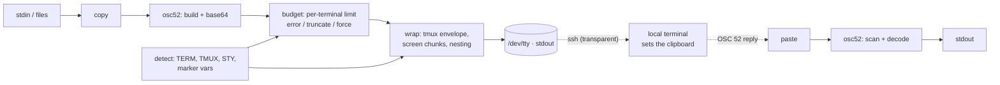

# clipwarp

[English](README.md) | [中文](README.zh.md) | [日本語](README.ja.md)

[](LICENSE) [](go.mod) [](CHANGELOG.md)  [](CONTRIBUTING.md)

**clipwarp：an open-source clipboard bridge for remote shells — copy and paste through SSH, tmux and screen with OSC 52, with passthrough wrapping, chunked large payloads and honest capability detection.**


```bash
git clone https://github.com/JaydenCJ/clipwarp && cd clipwarp
go build -o clipwarp ./cmd/clipwarp    # single static binary, stdlib only
```

> Pre-release: v0.1.0 is not tagged on a package registry yet; build from source as above (any Go ≥1.22, Linux/macOS/BSD).

## Why clipwarp?

"How do I copy from a remote shell without X forwarding?" gets asked weekly, and the standard answer — OSC 52, the escape sequence that rides the same bytes as your prompt — genuinely works everywhere SSH does. What doesn't work is the usual `printf '\e]52;c;%s\a' "$(base64)"` one-liner: tmux silently swallows the sequence unless it is wrapped in a `tmux;` DCS envelope with every inner ESC doubled; GNU screen forwards DCS but buffers it, so anything past ~768 bytes must be split into many small envelopes; nested tmux-inside-screen needs both wrappings in the right order; base64 inflates payloads past terminal limits that range from 100 KB to megabytes; and half the terminals claiming `TERM=xterm-256color` don't implement OSC 52 at all. clipwarp packages all of that: it detects the multiplexer stack and terminal from the environment (offline, no probing hangs), wraps and chunks correctly for any nesting, enforces per-terminal size budgets with an explicit truncate/force policy, and can decode any captured stream back for debugging. `pbcopy` for every box you SSH into — no daemon, no port forwarding, no X11.

| | clipwarp | printf one-liner | xclip/xsel over X11 | lemonade/netcat |
|---|---|---|---|---|
| Works over plain SSH | ✅ in-band OSC 52 | ✅ until tmux | ❌ needs `ssh -X` | ⚠️ reverse tunnel |
| tmux / screen passthrough | ✅ automatic, nested too | ❌ manual, usually wrong | ❌ | ❌ |
| Large payloads | ✅ chunked + budgets | ❌ silently dropped | ✅ | ✅ |
| Knows if it will work | ✅ `caps` verdict | ❌ try and pray | ❌ | ❌ |
| Paste (query) support | ✅ with honest timeout | ❌ | ✅ | ✅ |
| Server-side daemon | none | none | X server + client | daemon + open port |
| Runtime dependencies | 0 | 0 | X11 stack | Go daemon both ends |

<sub>Checked 2026-07-13: clipwarp imports the Go standard library only; xclip needs a running X server reachable from the remote host; lemonade requires its daemon listening on the local machine and a forwarded TCP port.</sub>

## Features

- **Copy that survives tmux and screen** — clipwarp reads `TMUX`, `STY` and `TERM`, wraps in the `ESC Ptmux;` envelope (every inner ESC doubled) or screen DCS envelopes as needed, and composes both for nested sessions in either order — overridable with `-mux tmux,screen`.
- **Chunking for large payloads** — screen's DCS buffer tops out near 768 bytes, so clipwarp splits the sequence across ≤256-byte envelopes that screen reassembles transparently; `-verbose` shows exactly how many chunks went out.
- **Per-terminal size budgets, explicit policy** — a 200 KB diff fits kitty's 8 MiB budget but not the conservative 100 KB default for unknown terminals; `-on-oversize error|truncate|force` decides, and truncation cuts on a whole base64 quantum with a warning, never mid-encoding.
- **Honest capability detection, fully offline** — `clipwarp caps` grades your terminal `yes / probably / opt-in / no` from environment evidence (marker variables beat `TERM` masquerades, VTE 0.76 boundary, iTerm2's preference toggle), tells you which setting to flip, and never hangs on an in-band probe.
- **Paste, not just copy** — `clipwarp paste` sends the OSC 52 query over `/dev/tty` in raw mode with a real deadline, accepts BEL / 7-bit ST / 8-bit ST replies arriving in dribbles, and `-stdin` decodes replies captured anywhere else.
- **A debugger for the whole pipeline** — `-dry-run` prints the exact wire bytes with visible escapes, `decode` extracts and unwraps OSC 52 from any recorded stream (both nesting orders), and `wrap`/`wrap -undo` expose the envelope logic as a plain byte filter.
- **Zero dependencies, fully offline** — Go standard library only; no network, no telemetry, ever. Exit codes are stable for scripting: 0 ok, 1 runtime failure, 2 usage error.

## Quickstart

```bash
# on the remote host, inside tmux, over SSH — check the situation first:
clipwarp caps
```

```text
terminal       unknown (via TERM=tmux-256color)
osc52          probably
max sequence   100000 bytes
multiplexer    tmux
wrap needed    true
ssh            true
note           tmux ≥ 3.3 needs `set -g allow-passthrough on`; `set -g set-clipboard on` lets tmux forward OSC 52 itself
note           the real terminal is hidden behind tmux; support depends on it
```

```bash
# copy a diff to your local clipboard, then check what actually hit the wire:
git diff | clipwarp copy
echo -n "deploy failed: connection reset" | clipwarp copy -dry-run
```

```text
\ePtmux;\e\e]52;c;ZGVwbG95IGZhaWxlZDogY29ubmVjdGlvbiByZXNldA==\a\e\
```

Real captured output — note the `tmux;` envelope and the doubled ESC. Inside screen, a 2 000-byte payload chunks automatically (`-verbose`, real output):

```text
clipwarp: target=c payload=2000 sequence=2676 budget=100000 mux=screen wrapped=2720 chunks=11 truncated=false
```

More runnable material in [examples/](examples/README.md): the everyday remote-copy loop and the two-line tmux.conf that makes passthrough work.

## Commands and flags

`clipwarp [copy|paste|caps|wrap|decode|version]` — exit codes: 0 ok, 1 runtime failure (oversize, no reply, unsupported with `-check`), 2 usage error.

| Flag | Default | Effect |
|---|---|---|
| `-target` (copy/paste) | `c` | selection: `c` clipboard, `p` primary, `s`/`q`/`0`–`7`; combinable (`-target pc`) |
| `-primary` (copy/paste) | off | shorthand for `-target p` (X11 primary selection) |
| `-mux` | `auto` | multiplexer chain, innermost first: `none`, `tmux`, `screen`, `tmux,screen` |
| `-out` (copy) | `auto` | where the sequence goes: controlling terminal, `-` for stdout, or a path |
| `-max-bytes` (copy) | detected | sequence size budget; 0 uses the terminal table (100 000 for unknown) |
| `-on-oversize` (copy) | `error` | `error`, `truncate` (whole base64 quantum + warning) or `force` |
| `-trim` (copy) | off | drop one trailing newline — for `echo \| clipwarp copy` pipelines |
| `-clear` (copy) | off | clear the selection instead of setting it |
| `-st` | off | terminate with `ESC \` instead of BEL |
| `-dry-run` (copy) | off | print the wire bytes with visible escapes, touch nothing |
| `-verbose` (copy) | off | report sizes, wrapping and chunk counts on stderr |
| `-stdin` (paste) | off | decode a captured reply from stdin instead of querying the terminal |
| `-timeout` (paste) | `2s` | how long to wait for the terminal's reply |
| `-newline` (paste) | off | append a newline to the pasted bytes |
| `-json` (caps/decode) | off | machine-readable output (stable field names) |
| `-all` (decode) | off | print every sequence's payload, not just the first |
| `-check` (caps) | off | exit 1 when the terminal is known to lack OSC 52 |

Known limitations in 0.1.0: interactive `paste` needs a POSIX platform (Linux/macOS/BSD termios; `-stdin` works everywhere); many terminals deliberately refuse selection *queries* — copy is universal, paste is not; zellij and other multiplexers are not auto-detected yet.

## Verification

This repository ships no CI; every claim above is verified by local runs:

```bash
go test ./...            # 89 deterministic tests, offline, no sleeps, < 5 s
bash scripts/smoke.sh    # real copy→wire→decode loops incl. nesting, prints SMOKE OK
```

## Architecture



## Roadmap

- [x] v0.1.0 — copy/paste/caps/wrap/decode, tmux+screen passthrough with nesting, screen chunking, size budgets, offline detection, 89 tests + smoke script
- [ ] zellij passthrough detection and wrapping
- [ ] kitty's chunked-transfer extension for multi-megabyte payloads
- [ ] `caps -probe`: opt-in in-band DA1-bounded feature probe for interactive shells
- [ ] Windows support for interactive paste (ConPTY virtual terminal input)
- [ ] shell helpers (`clipwarp shell-init`) providing `pbcopy`/`pbpaste`-style aliases

See the [open issues](https://github.com/JaydenCJ/clipwarp/issues) for the full list.

## Contributing

Issues, discussions and pull requests are welcome — see [CONTRIBUTING.md](CONTRIBUTING.md) for the local workflow (format, vet, tests, `SMOKE OK`). Good entry points are labelled [good first issue](https://github.com/JaydenCJ/clipwarp/issues?q=is%3Aissue+is%3Aopen+label%3A%22good+first+issue%22), and design questions live in [Discussions](https://github.com/JaydenCJ/clipwarp/discussions).

## License

[MIT](LICENSE)
