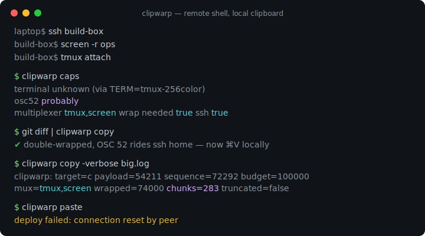
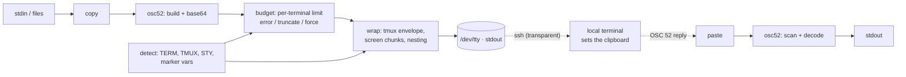

# clipwarp

[English](README.md) | [中文](README.zh.md) | [日本語](README.ja.md)

[](LICENSE) [](go.mod) [](CHANGELOG.md)  [](CONTRIBUTING.md)

**clipwarp：面向远程 shell 的开源剪贴板桥梁——用 OSC 52 穿越 SSH、tmux 和 screen 完成复制粘贴，自带 passthrough 包装、大负载分块和诚实的能力检测。**



```bash
git clone https://github.com/JaydenCJ/clipwarp && cd clipwarp
go build -o clipwarp ./cmd/clipwarp    # single static binary, stdlib only
```

> 预发布：v0.1.0 尚未发布到任何包仓库；请按上述方式从源码构建（Go ≥1.22 均可，Linux/macOS/BSD）。

## 为什么选 clipwarp？

"没有 X 转发怎么从远程 shell 复制？"每周都有人在问，而标准答案——OSC 52，这个与你的提示符走同一条字节流的转义序列——在 SSH 能到的地方确实都能用。不能用的是常见的 `printf '\e]52;c;%s\a' "$(base64)"` 一行命令：tmux 会悄悄吞掉该序列，除非把它包进 `tmux;` DCS 信封并把内部每个 ESC 加倍；GNU screen 虽转发 DCS 但会先缓冲，超过约 768 字节就必须拆成许多小信封；tmux 嵌套在 screen 里时两层包装的顺序还必须正确；base64 会把负载膨胀到超出终端上限，而各终端上限从 100 KB 到数 MB 不等；更别提一半声称 `TERM=xterm-256color` 的终端根本没实现 OSC 52。clipwarp 把这一切打包解决：从环境离线识别多路复用器栈和终端（不做会卡死的探测），对任意嵌套正确地包装与分块，按终端执行大小预算并提供明确的截断/强制策略，还能把任何抓取的字节流解码回来用于调试。相当于给你 SSH 到的每台机器装上 `pbcopy`——没有守护进程、没有端口转发、没有 X11。

| | clipwarp | printf 一行命令 | xclip/xsel（X11） | lemonade/netcat |
|---|---|---|---|---|
| 纯 SSH 下可用 | ✅ 带内 OSC 52 | ✅ 直到遇上 tmux | ❌ 需要 `ssh -X` | ⚠️ 反向隧道 |
| tmux / screen 穿透 | ✅ 自动，含嵌套 | ❌ 手工且常出错 | ❌ | ❌ |
| 大负载 | ✅ 分块 + 预算 | ❌ 被悄悄丢弃 | ✅ | ✅ |
| 能预知是否可用 | ✅ `caps` 给结论 | ❌ 试了才知道 | ❌ | ❌ |
| 粘贴（查询）支持 | ✅ 带诚实超时 | ❌ | ✅ | ✅ |
| 服务器端守护进程 | 无 | 无 | X 服务器 + 客户端 | 两端守护进程 + 开放端口 |
| 运行时依赖 | 0 | 0 | X11 全家桶 | 两端各一个 Go 守护进程 |

<sub>核对于 2026-07-13：clipwarp 只导入 Go 标准库；xclip 需要远程主机可达的运行中 X 服务器；lemonade 需要本机监听的守护进程和一条转发的 TCP 端口。</sub>

## 功能特性

- **穿越 tmux 和 screen 的复制** — clipwarp 读取 `TMUX`、`STY` 与 `TERM`，按需包进 `ESC Ptmux;` 信封（内部每个 ESC 加倍）或 screen 的 DCS 信封，嵌套会话两种顺序都能正确组合——可用 `-mux tmux,screen` 覆盖。
- **大负载分块** — screen 的 DCS 缓冲区上限约 768 字节，clipwarp 把序列拆进 ≤256 字节的信封，由 screen 透明地重新拼接；`-verbose` 精确显示发出了多少块。
- **按终端的大小预算与明确策略** — 200 KB 的 diff 装得进 kitty 的 8 MiB 预算，却超出未知终端 100 KB 的保守默认；`-on-oversize error|truncate|force` 决定去留，截断按整个 base64 量子切割并给出警告，绝不切在编码中间。
- **诚实的能力检测，完全离线** — `clipwarp caps` 依据环境证据给你的终端评级 `yes / probably / opt-in / no`（标记变量优先于伪装的 `TERM`、VTE 0.76 分界、iTerm2 的偏好开关），告诉你该翻哪个设置，绝不因带内探测而卡死。
- **不止复制，还有粘贴** — `clipwarp paste` 在 raw 模式下经 `/dev/tty` 发送 OSC 52 查询并带真实超时，接受以 BEL / 7 位 ST / 8 位 ST 结尾、分片到达的应答；`-stdin` 可解码在任何地方抓取的应答。
- **整条管线的调试器** — `-dry-run` 以可见转义打印确切的线上字节，`decode` 从任何录制的字节流中提取并解包 OSC 52（两种嵌套顺序皆可），`wrap`/`wrap -undo` 把信封逻辑暴露为纯字节过滤器。
- **零依赖，完全离线** — 仅 Go 标准库；永不联网、永无遥测。退出码对脚本稳定：0 成功，1 运行时失败，2 用法错误。

## 快速上手

```bash
# on the remote host, inside tmux, over SSH — check the situation first:
clipwarp caps
```

```text
terminal       unknown (via TERM=tmux-256color)
osc52          probably
max sequence   100000 bytes
multiplexer    tmux
wrap needed    true
ssh            true
note           tmux ≥ 3.3 needs `set -g allow-passthrough on`; `set -g set-clipboard on` lets tmux forward OSC 52 itself
note           the real terminal is hidden behind tmux; support depends on it
```

```bash
# copy a diff to your local clipboard, then check what actually hit the wire:
git diff | clipwarp copy
echo -n "deploy failed: connection reset" | clipwarp copy -dry-run
```

```text
\ePtmux;\e\e]52;c;ZGVwbG95IGZhaWxlZDogY29ubmVjdGlvbiByZXNldA==\a\e\
```

真实抓取的输出——注意 `tmux;` 信封和加倍的 ESC。在 screen 里，2 000 字节的负载会自动分块（`-verbose`，真实输出）：

```text
clipwarp: target=c payload=2000 sequence=2676 budget=100000 mux=screen wrapped=2720 chunks=11 truncated=false
```

更多可运行的材料见 [examples/](examples/README.md)：日常的远程复制循环，以及让 passthrough 生效的两行 tmux.conf。

## 命令与参数

`clipwarp [copy|paste|caps|wrap|decode|version]` —— 退出码：0 成功，1 运行时失败（超出预算、无应答、`-check` 下不支持），2 用法错误。

| 参数 | 默认值 | 作用 |
|---|---|---|
| `-target` (copy/paste) | `c` | 选区：`c` 剪贴板、`p` primary、`s`/`q`/`0`–`7`；可组合（`-target pc`） |
| `-primary` (copy/paste) | 关 | `-target p` 的简写（X11 primary 选区） |
| `-mux` | `auto` | 多路复用器链，最内层在前：`none`、`tmux`、`screen`、`tmux,screen` |
| `-out` (copy) | `auto` | 序列去向：控制终端、`-` 表示 stdout，或一个路径 |
| `-max-bytes` (copy) | 自动检测 | 序列大小预算；0 使用终端表（未知终端为 100 000） |
| `-on-oversize` (copy) | `error` | `error`、`truncate`（按整 base64 量子 + 警告）或 `force` |
| `-trim` (copy) | 关 | 去掉一个结尾换行——用于 `echo \| clipwarp copy` 管道 |
| `-clear` (copy) | 关 | 清空选区而不是设置它 |
| `-st` | 关 | 用 `ESC \` 而非 BEL 结尾 |
| `-dry-run` (copy) | 关 | 以可见转义打印线上字节，不做任何操作 |
| `-verbose` (copy) | 关 | 在 stderr 上报告大小、包装与分块数量 |
| `-stdin` (paste) | 关 | 从 stdin 解码抓取的应答，而不是查询终端 |
| `-timeout` (paste) | `2s` | 等待终端应答的时长 |
| `-newline` (paste) | 关 | 在粘贴出的字节末尾追加一个换行 |
| `-json` (caps/decode) | 关 | 机器可读输出（字段名稳定） |
| `-all` (decode) | 关 | 打印每个序列的负载，而不只是第一个 |
| `-check` (caps) | 关 | 终端已知不支持 OSC 52 时退出码为 1 |

0.1.0 的已知限制：交互式 `paste` 需要 POSIX 平台（Linux/macOS/BSD 的 termios；`-stdin` 到处可用）；许多终端刻意拒绝选区*查询*——复制是普适的，粘贴不是；zellij 等其他多路复用器尚未自动检测。

## 验证

本仓库不附带 CI；上面的每一条声明都由本地运行验证：

```bash
go test ./...            # 89 deterministic tests, offline, no sleeps, < 5 s
bash scripts/smoke.sh    # real copy→wire→decode loops incl. nesting, prints SMOKE OK
```

## 架构



## 路线图

- [x] v0.1.0 —— copy/paste/caps/wrap/decode、tmux+screen 穿透含嵌套、screen 分块、大小预算、离线检测、89 个测试 + smoke 脚本
- [ ] zellij 的穿透检测与包装
- [ ] kitty 的分块传输扩展，支持多 MB 负载
- [ ] `caps -probe`：交互式 shell 下可选的、以 DA1 兜底的带内特性探测
- [ ] Windows 上的交互式粘贴支持（ConPTY 虚拟终端输入）
- [ ] shell 辅助函数（`clipwarp shell-init`），提供 `pbcopy`/`pbpaste` 风格的别名

完整列表见 [open issues](https://github.com/JaydenCJ/clipwarp/issues)。

## 参与贡献

欢迎 issue、讨论与 PR——本地工作流（格式化、vet、测试、`SMOKE OK`）见 [CONTRIBUTING.md](CONTRIBUTING.md)。入门任务标注为 [good first issue](https://github.com/JaydenCJ/clipwarp/issues?q=is%3Aissue+is%3Aopen+label%3A%22good+first+issue%22)，设计讨论在 [Discussions](https://github.com/JaydenCJ/clipwarp/discussions)。

## 许可证

[MIT](LICENSE)
